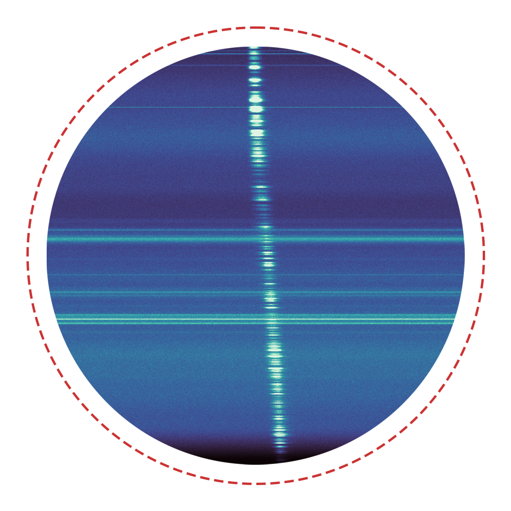

# Methods for Sonifying Pulse (MSP)

_✨ Sonifying a radio pulse ✨_  

  

## Description

  射电望远镜可以将电磁场数字化采样并记录下来，这样的产生的原始数据格式与常见的Wave音频文件是完全一致的。但是射电望远镜接收信号的频率往往不在人耳听力范围内，需要将原始数据混频，降频到可听的频段才行。

  然而，这样的原始数据非常占用存储，一般望远镜也不会大规模记录这样的数据。通常是对数据进行傅立叶变换，转换到时间-频率空间，并且丢掉相位信息，如题图所示。这样可以节省大量的存储空间。但正因丢掉了相位信息，我们无法将这样的数据恢复为原始数据。

  如何将这种经过傅立叶变换后的数据声化？ 这里给出了几种声化方法的例子。

  
 - 

  第一种是使用`astronify`，这是一个将光变曲线声化的python库。先将我们的数据沿着频率轴做平均，只留脉冲轮廓。之后`astronify`可以将轮廓强度映射到音高，并写成音频文件。

  但其实我不太喜欢这种写法，写出来的声音有些奇怪，并且对参数要求很高，更适合光学波段的光变曲线。

  
 - 

  第二种是直接将脉冲轮廓写入Wave文件。这种写法对不同数据写出来的音频听起来大差不差，因此可以将不同乐器的音频与脉冲轮廓卷积，以实现不同的音色。

  
 - 

  第三种就是使用短时逆傅立叶变换。前面我们提到数据的相位信息已经丢掉，无法恢复成原始数据。但是我们可以假设一个相位信息，强行做`ISTFT`。这样得到的音频在`Au`中打开看频谱就是类似题图这样的东西。