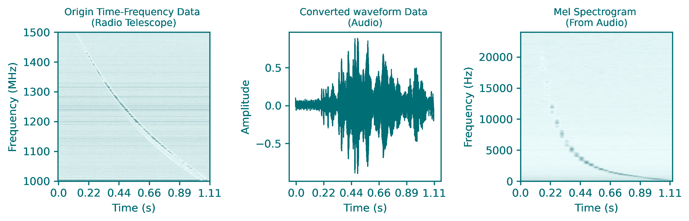

# Methods for Sonifying Pulse (MSP)

_✨ Sonifying a radio pulse ✨_

  

## Description

  射电望远镜可以将电磁场数字化采样并记录下来，这样的产生的原始数据格式与常见的Wave音频文件是完全一致的。但是射电望远镜接收信号的频率往往不在人耳听力范围内，需要将原始数据混频，降频到可听的频段才行。

  然而，这样的原始数据非常占用存储，一般望远镜也不会大规模记录这样的数据。通常是对数据进行傅立叶变换，转换到时间-频率空间，并且丢掉相位信息，如题图所示。这样可以节省大量的存储空间。但正因丢掉了相位信息，我们无法将这样的数据恢复为原始数据。

  如何将这种经过傅立叶变换后的数据声化？ 这里给出了几种声化方法的例子。

## 方法列表

  

  
第一种方法

   
  

  第一种是使用`astronify`，这是一个将光变曲线声化的python库。例子在`0-astronify.py`中。

  先将我们的数据沿着频率轴做平均，只留脉冲轮廓。之后`astronify`可以将轮廓强度映射到音高，并写成音频文件。但其实我不太喜欢这种写法，写出来的声音有些奇怪，并且对参数要求很高，更适合光学波段的光变曲线（比较平滑的那种）。

  

  

  

  
第二种方法

   
  

  第二种是直接将脉冲轮廓写入Wave文件。例子在`1-profile2wave.py`中。

  这种写法对不同数据写出来的音频听起来大差不差，因此可以将不同乐器的音频与脉冲轮廓卷积，以实现不同的音色。

  

  

  

  
第三种方法

   
  

  第三种是脉冲轮廓对应响度。例子在`2-amp2loud.py`中。

  

  

  

  
第四种方法

   
  

  第四种就是使用声码器（Vocoder）。例子在`3-griffinlim.py`和`4-hifi-gan.py`中。

  前面我们提到数据的相位信息已经丢掉，无法恢复成原始数据。但是我们可以假设一个相位信息，做`ISTFT`。也即将时间-频率数据作为Mel声谱，据此还原音频。传统的比较好用的是`griffin_lim`声码器，它假设了一个初始相位，通过迭代，是还原出来音频的Mel声谱接近提供的Mel声谱。

  随着深度学习技术的发展，TTS逐渐成熟。除了端到端的TTS，还有二阶段TTS，也即先通过文字生成Mel声谱，再将Mel声谱转换为声音。第二阶段也会用到类似的声码器。`Neural Vocoder`也从最初的`WaveNet`、`WaveRNN`、`UnivNet`，到现在的`HiFi-GAN`和`BigVGAN`。这里用的是`HiFi-GAN`已经预训练好的`Universal V1`模型，在[BigVGAN](https://bigvgan-demo.github.io/)的音频例子中，可以看到，`HiFi-GAN`对于器乐还原的效果还不错，是可用的状态。关于[HiFi-GAN](https://github.com/jik876/hifi-gan)的更多细节，可以查看官方的repo。

  在`HiFi-GAN`的`UniversalV1`模型基础上，我们使用500首交响乐曲对模型进行微调，继续训练了500k步，模型放在`HiFiGAN/model`中。新模型在我们的数据上做测试，效果也还可以。

  如下图中例子，左边是原始数据在时间-频率空间中的表现，右边转换到音频后短时傅里叶变换的结果。由于人耳对于声音的感应是对数的，因此轮廓经过了对数映射。

  

  

  

  
 - 

  

  
 *第五种方法* 

   
  

  例子在`5-musicnet.py`中。或许不算一种新的方法，只是对输出的音乐进行风格迁移。使用的是[A Universal Music Translation Network](https://arxiv.org/abs/1805.07848)中的[模型](https://github.com/facebookresearch/music-translation)。

  他们提供了5个预训练模型，对应的风格分别是
  | 序号   | 0         | 1        | 2           | 3           | 4             | 5           |
  | ---   | ---------- | -------- | --------- | ----------- | ------------- | ----------- |
  | 乐器   | 伴奏小提琴 | 独奏大提琴 | 独奏钢琴   | 独奏钢琴   | 弦乐四重奏     | 管风琴五重奏 |
  | 作曲家 | 贝多芬     | 巴赫      | 巴赫       | 贝多芬     | 贝多芬       | 卡姆比尼   |

  

  

  
 - 
