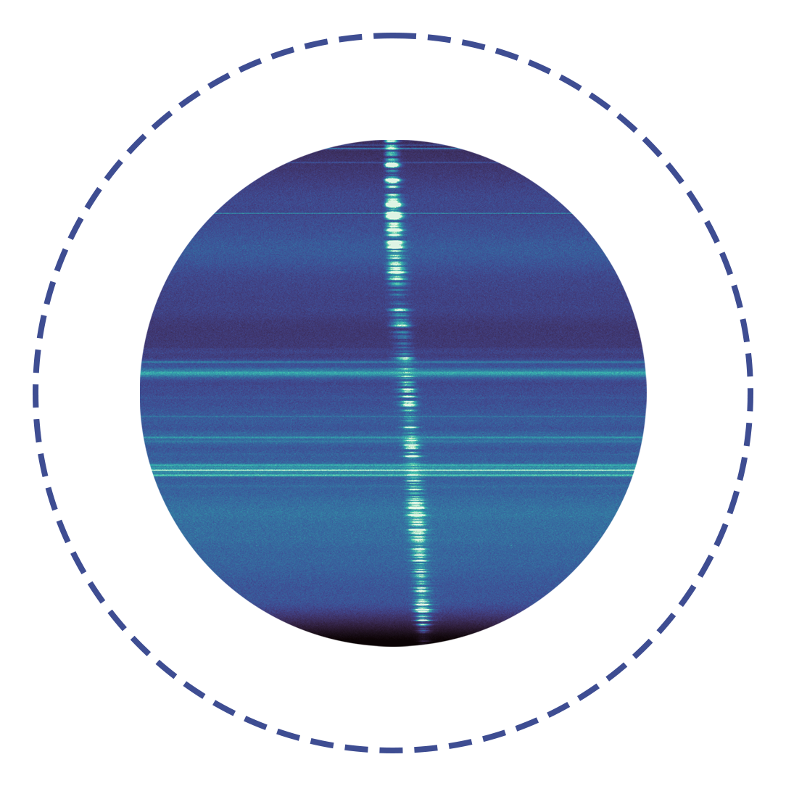

<div align="center">

<div align="center"></div>

# AstroSonify

_Sonifying radio pulses with multiple methods_

</div>

<p align="center">
  <a href="https://pypi.org/project/astrosonify/">
    
  </a>
  <a href="https://github.com/SukiYume/MSP">
    
  </a>
  <a href="./LICENSE">
    
  </a>
</p>

<p align="center">
  <a href="./README_CN.md" target="_blank">切换到中文</a>
</p>

## Description

Radio telescopes digitize and record electromagnetic signals, but the received frequencies are typically outside the range of human hearing. The raw data is usually Fourier-transformed into the time-frequency domain with phase information discarded to save storage. This means the original waveform cannot be recovered.

**AstroSonify** provides 6 methods to convert such phase-less time-frequency data into audible sound, ranging from simple profile mapping to neural vocoder reconstruction.

## What's New (v0.1.1)

- Fixed `rebin_spectrogram()` edge-case crashes when target bins exceed input dimensions.
- Corrected `amplitude_modulate(freq=...)` to map `freq` directly to physical Hz.
- Added explicit CUDA availability check in `musicnet()`.
- Added safer model loading path using `torch.load(..., weights_only=True)` when supported.
- Added CLI subcommand `astrosonify astronify` (method 0).
- Added cache-dir override support with `ASTROSONIFY_CACHE_DIR`.

## Installation

```bash
# Core package (methods 1-3)
pip install astrosonify

# With HiFi-GAN neural vocoder (method 4)
pip install astrosonify[hifigan]

# With MusicNet style transfer (method 5)
pip install astrosonify[musicnet]

# With astronify (method 0)
pip install astrosonify[astronify]

# Everything
pip install astrosonify[all]
```

### Development setup (reproducible test path)

```bash
python -m pip install --upgrade pip
pip install -e .[dev]
pytest -q
```

Notes:
- `soundfile` may require system libraries (`libsndfile`) on some platforms.
- Optional method extras are separate by design: `astronify`, `hifigan`, `musicnet`.

## Quick Start

### Python API

```python
import astrosonify as asf

# Load example data from Hugging Face Hub
data = asf.load_example("burst")        # 2D spectrogram (time x freq)
profile = asf.load_example("profile")   # 1D pulse profile

# Method 1: Profile to waveform (with violin convolution)
audio, sr = asf.profile_to_wave(data, sr=48000, duration=10, instrument="violin")

# Method 2: Amplitude-modulated sine wave
audio, sr = asf.amplitude_modulate(profile, sr=48000, duration=2, freq=1000)

# Method 3: Griffin-Lim vocoder
audio, sr = asf.griffinlim(data, sr=48000, n_iter=200)

# Method 4: HiFi-GAN neural vocoder (requires torch)
audio, sr = asf.hifigan(data)

# Method 5: WaveNet music style transfer (torch required, CUDA recommended)
audio, sr = asf.musicnet("input.wav", decoder_id=2)

# Save output
asf.save_audio(audio, sr, "output.wav")
```

### CLI

```bash
# List available methods
astrosonify list-methods

# Sonify with Griffin-Lim
astrosonify griffinlim --input burst.npy --output burst.wav --sr 48000

# Sonify with profile method
astrosonify profile --input burst.npy --output profile.wav --instrument violin

# Sonify with astronify pitch mapping
astrosonify astronify --input profile.npy --output astronify.wav --note-spacing 0.02 --downsample 5

# Sonify with amplitude modulation
astrosonify amplitude --input profile.npy --output amp.wav --freq 1000

# Download example data
astrosonify download-examples --dest ./data/
```

All `--input` paths in CLI commands now use existence validation for clearer user-facing errors.

## Methods

| # | Method | Function | Dependencies |
|---|--------|----------|-------------|
| 0 | Astronify (pitch mapping) | `astronify_sonify()` | astropy, astronify |
| 1 | Profile to waveform | `profile_to_wave()` | core |
| 2 | Amplitude modulation | `amplitude_modulate()` | core |
| 3 | Griffin-Lim vocoder | `griffinlim()` | core |
| 4 | HiFi-GAN neural vocoder | `hifigan()` | torch, scikit-image |
| 5 | WaveNet style transfer | `musicnet()` | torch, tqdm (CUDA optional, faster) |

### Input Handling

- **Profile methods (0, 1, 2)**: Accept 1D profile or 2D spectrogram (auto-averages along frequency axis)
- **Spectrogram methods (3, 4)**: Accept 2D spectrogram (auto-rebins to target dimensions)
- **MusicNet (5)**: Accepts WAV file path or 1D audio array

All methods return `(audio_array, sample_rate)` tuple.

### Length & Downsampling Reference

Let input shape be `(T, F)` for 2D data, or length `N` for 1D data.

| # | Method | Output sample rate | Output duration from input length | Practical downsampling target |
|---|--------|--------------------|-----------------------------------|-------------------------------|
| 0 | `astronify_sonify` | Determined by astronify output WAV | If effective points are `L = floor(T / d)` (or `floor(N / d)`), duration is approximately `L * note_spacing` seconds (`note_spacing` default 0.01s) | Choose `L` around 200-2000 notes (e.g. `d = T / 1000`) |
| 1 | `profile_to_wave` | User-set `sr` (default 48000) | Exactly `duration` seconds (default 10s), independent of input point count after interpolation | For stable timbre/envelope, keep effective profile length `L` around 200-5000 |
| 2 | `amplitude_modulate` | User-set `sr` (default 48000) | Exactly `duration` seconds (default 2s), independent of input point count after interpolation | Similar to method 1, keep `L` around 200-5000 |
| 3 | `griffinlim` | User-set `sr` (default 48000) | With `time_rebin = B_t`, duration is about `B_t * (frame_length/4)`; default `frame_length=0.04`, so `≈ B_t * 0.01` sec | Set `time_rebin ≈ 100 * target_seconds`; set `freq_rebin` to 256-512 |
| 4 | `hifigan` | From model config (`sampling_rate`, current model: 22050) | With `time_rebin = B_t`, duration is approximately `B_t * hop_size / sampling_rate`; current model uses `hop_size=256`, so `≈ B_t * 0.01161` sec | Set `time_rebin ≈ target_seconds * 22050 / 256` (about `86 * target_seconds`) |
| 5 | `musicnet` | User-set `sr` (default 48000) | Approximately keeps input WAV duration, but quantized by model stride: output samples `≈ floor(N/800) * 800` (current `encoder_pool=800`) | Usually no extra downsampling; trim/segment long inputs before conversion |

#### Legacy-compatible fixed bins (reference)

For users migrating from the legacy scripts, these fixed values reproduce the same time/frequency compression behavior in tests:

- Method 3 (`griffinlim`): `time_rebin=128`, `freq_rebin=512`
- Method 4 (`hifigan`): `time_rebin=128` (frequency is always resized to 80 mel bins by the model path)

These values are now used in test coverage as reproducible listenable defaults; production usage can keep them configurable.

#### 2D input: recommended size for the other axis (frequency)

- Methods 0/1/2: 2D input is averaged along frequency (`mean(axis=1)`), so there is no strict frequency-bin target; keep at least `F >= 32`, with `64-1024` as a common practical range.
- Method 3 (`griffinlim`): frequency is rebinned to `freq_rebin` (or `n_mels` if unset, default `512`); recommended output frequency bins are `256-512`, with `512` for legacy alignment.
- Method 4 (`hifigan`): preprocessing always rescales frequency to `80` mel bins; input frequency length is flexible, but `F >= 80` (commonly `256-1024`) is recommended to reduce detail loss.

Practical setup: choose `time_rebin` from target duration first, then set method 3 `freq_rebin` to `256` or `512`; for method 4, keep original frequency resolution reasonably high.

#### Quick reference by common input shapes

> The presets below target roughly 1-3 second outputs with listenable structure retained.

| Input shape `(T, F)` | Recommended for method 3 (`griffinlim`) | Recommended for method 4 (`hifigan`) | Estimated duration |
|---|---|---|---|
| `(1024, 256)` | `time_rebin=100`, `freq_rebin=256` | `time_rebin=100` | M3: ~1.0s; M4: ~1.16s |
| `(2048, 512)` | `time_rebin=128`, `freq_rebin=512` | `time_rebin=128` | M3: ~1.28s; M4: ~1.49s |
| `(4096, 512)` | `time_rebin=200`, `freq_rebin=512` | `time_rebin=200` | M3: ~2.0s; M4: ~2.32s |
| `(8192, 1024)` | `time_rebin=300`, `freq_rebin=512` | `time_rebin=300` | M3: ~3.0s; M4: ~3.48s |

Notes:

- Method 3 duration is approximately `time_rebin × 0.01s` with default parameters.
- Method 4 duration is approximately `time_rebin × 256 / 22050 ≈ time_rebin × 0.01161s`.
- Use `freq_rebin=512` for better frequency detail, or `256` for faster/lighter runs.

### Vocoder Comparison

<div align="center"></div>

Left: original time-frequency data. Right: reconstructed spectrogram after vocoder conversion.

### MusicNet Style Transfer

| Decoder ID | 0 | 1 | 2 | 3 | 4 | 5 |
|------------|---|---|---|---|---|---|
| Instrument | Accompaniment Violin | Solo Cello | Solo Piano | Solo Piano | String Quartet | Organ Quintet |
| Composer | Beethoven | Bach | Bach | Beethoven | Beethoven | Cambini |

## Data & Models

Example data and pre-trained models are hosted on [Hugging Face Hub](https://huggingface.co/TorchLight/astrosonify) and downloaded automatically on first use.

### Cache directory

By default, files are cached under `~/.cache/astrosonify`.

You can override this with:

```bash
export ASTROSONIFY_CACHE_DIR=/path/to/cache
```

Windows PowerShell:

```powershell
$env:ASTROSONIFY_CACHE_DIR = "D:\\astrosonify-cache"
```

### Trust & safety note for model files

This project downloads model checkpoints from the official repository on Hugging Face Hub. Loading uses a safer weights-only path where available (`torch.load(..., weights_only=True)`), with backward-compatible fallback for older PyTorch versions.

For the original standalone scripts and data files, see the [`legacy/original-scripts`](https://github.com/SukiYume/MSP/tree/legacy/original-scripts) branch.

## License

MIT License. See [LICENSE](./LICENSE).

Third-party model code:
- HiFi-GAN: [jik876/hifi-gan](https://github.com/jik876/hifi-gan) (MIT)
- MusicNet: [facebookresearch/music-translation](https://github.com/facebookresearch/music-translation)
