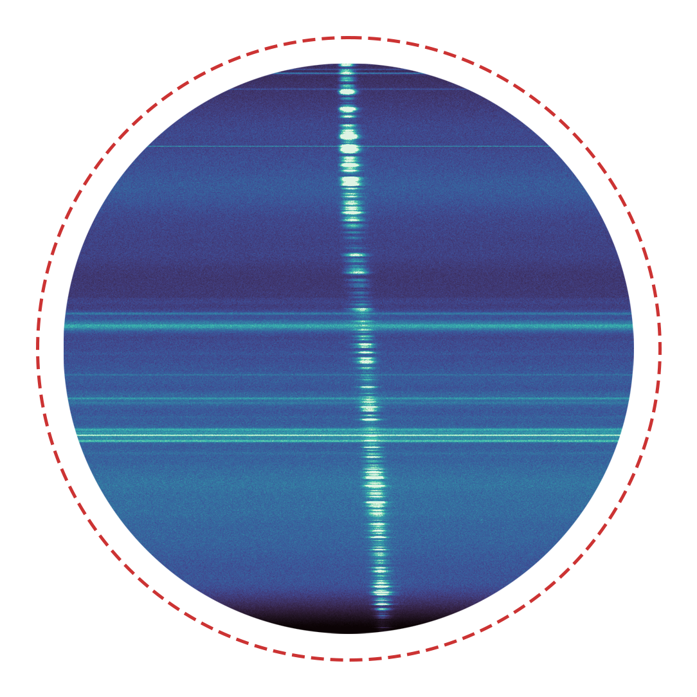
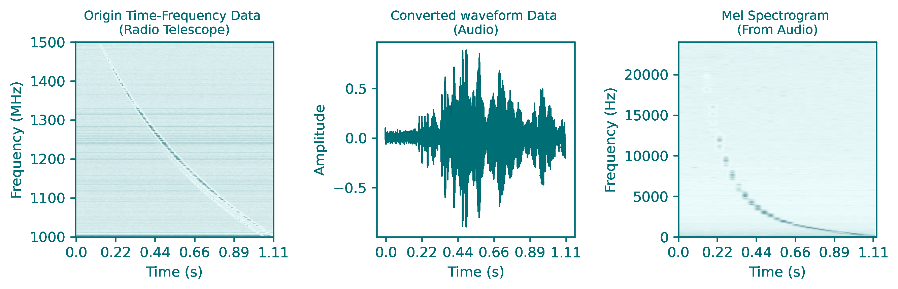

<div align="center">

<div align="center"></div>

# AstroSonify

_Sonifying radio pulses with multiple methods_

</div>

<p align="center">
  <a href="https://pypi.org/project/astrosonify/">
    
  </a>
  <a href="https://github.com/SukiYume/MSP">
    
  </a>
  <a href="./LICENSE">
    
  </a>
</p>

<p align="center">
  <a href="./README_CN.md" target="_blank">切换到中文</a>
</p>

## Description

Radio telescopes digitize and record electromagnetic signals, but the received frequencies are typically outside the range of human hearing. The raw data is usually Fourier-transformed into the time-frequency domain with phase information discarded to save storage. This means the original waveform cannot be recovered.

**AstroSonify** provides 6 methods to convert such phase-less time-frequency data into audible sound, ranging from simple profile mapping to neural vocoder reconstruction.

## Installation

```bash
# Core package (methods 1-3)
pip install astrosonify

# With HiFi-GAN neural vocoder (method 4)
pip install astrosonify[hifigan]

# With MusicNet style transfer (method 5)
pip install astrosonify[musicnet]

# With astronify (method 0)
pip install astrosonify[astronify]

# Everything
pip install astrosonify[all]
```

## Quick Start

### Python API

```python
import astrosonify as asf

# Load example data from Hugging Face Hub
data = asf.load_example("burst")        # 2D spectrogram (time x freq)
profile = asf.load_example("profile")   # 1D pulse profile

# Method 1: Profile to waveform (with violin convolution)
audio, sr = asf.profile_to_wave(data, sr=48000, duration=10, instrument="violin")

# Method 2: Amplitude-modulated sine wave
audio, sr = asf.amplitude_modulate(profile, sr=48000, duration=2, freq=1000)

# Method 3: Griffin-Lim vocoder
audio, sr = asf.griffinlim(data, sr=48000, n_iter=200)

# Method 4: HiFi-GAN neural vocoder (requires torch)
audio, sr = asf.hifigan(data)

# Method 5: WaveNet music style transfer (requires torch + CUDA)
audio, sr = asf.musicnet("input.wav", decoder_id=2)

# Save output
asf.save_audio(audio, sr, "output.wav")
```

### CLI

```bash
# List available methods
astrosonify list-methods

# Sonify with Griffin-Lim
astrosonify griffinlim --input burst.npy --output burst.wav --sr 48000

# Sonify with profile method
astrosonify profile --input burst.npy --output profile.wav --instrument violin

# Sonify with amplitude modulation
astrosonify amplitude --input profile.npy --output amp.wav --freq 1000

# Download example data
astrosonify download-examples --dest ./data/
```

## Methods

| # | Method | Function | Dependencies |
|---|--------|----------|-------------|
| 0 | Astronify (pitch mapping) | `astronify_sonify()` | astropy, astronify |
| 1 | Profile to waveform | `profile_to_wave()` | core |
| 2 | Amplitude modulation | `amplitude_modulate()` | core |
| 3 | Griffin-Lim vocoder | `griffinlim()` | core |
| 4 | HiFi-GAN neural vocoder | `hifigan()` | torch, scikit-image |
| 5 | WaveNet style transfer | `musicnet()` | torch, tqdm, CUDA |

### Input Handling

- **Profile methods (0, 1, 2)**: Accept 1D profile or 2D spectrogram (auto-averages along frequency axis)
- **Spectrogram methods (3, 4)**: Accept 2D spectrogram (auto-rebins to target dimensions)
- **MusicNet (5)**: Accepts WAV file path or 1D audio array

All methods return `(audio_array, sample_rate)` tuple.

### Vocoder Comparison

<div align="center"></div>

Left: original time-frequency data. Right: reconstructed spectrogram after vocoder conversion.

### MusicNet Style Transfer

| Decoder ID | 0 | 1 | 2 | 3 | 4 | 5 |
|------------|---|---|---|---|---|---|
| Instrument | Accompaniment Violin | Solo Cello | Solo Piano | Solo Piano | String Quartet | Organ Quintet |
| Composer | Beethoven | Bach | Bach | Beethoven | Beethoven | Cambini |

## Data & Models

Example data and pre-trained models are hosted on [Hugging Face Hub](https://huggingface.co/SukiYume/astrosonify) and downloaded automatically on first use.

For the original standalone scripts and data files, see the [`legacy/original-scripts`](https://github.com/SukiYume/MSP/tree/legacy/original-scripts) branch.

## License

MIT License. See [LICENSE](./LICENSE).

Third-party model code:
- HiFi-GAN: [jik876/hifi-gan](https://github.com/jik876/hifi-gan) (MIT)
- MusicNet: [facebookresearch/music-translation](https://github.com/facebookresearch/music-translation)
