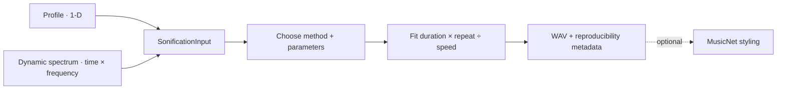

<h1 align="center">MSP · RadioSonify</h1>

<p align="center">
  
</p>

<p align="center">
  <strong>Turn radio pulse data into audio you can listen to</strong><br>
  A profile or a dynamic spectrum goes in. A WAV of the duration you choose comes out.
</p>

<p align="center">
  
  <a href="https://huggingface.co/TorchLight/radiosonify"></a>
  <a href="https://github.com/SukiYume/MSP/blob/main/THIRD_PARTY_NOTICES.md"></a>
</p>

<p align="center">
  <a href="#install">Install</a> ·
  <a href="#quick-start">Quick start</a> ·
  <a href="#your-data">Data</a> ·
  <a href="#methods">Methods</a> ·
  <a href="#duration-speed-and-repeat">Timing</a> ·
  <a href="#what-you-get-back">Result</a> ·
  <a href="https://github.com/SukiYume/MSP/blob/main/README_CN.md">中文</a>
</p>

---

## What MSP does

Radio telescopes record scientific arrays. MSP maps two of those arrays onto sound:

- a one-dimensional **pulse profile**, and
- a two-dimensional **dynamic spectrum** (time × frequency).

You supply the array and the physical time span it covers. MSP picks a suitable
method, synthesizes the audio at exactly the duration you ask for, and returns
the waveform together with every parameter used to produce it.


```mermaid
flowchart LR
    A["Profile · 1-D"] --> C["SonificationInput"]
    B["Dynamic spectrum · time × frequency"] --> C
    C --> D["Choose method + parameters"]
    D --> E["Fit duration × repeat ÷ speed"]
    E --> F["WAV + reproducibility metadata"]
    F -. optional .-> G["MusicNet styling"]
```

## Install

Install a released package from PyPI:

```bash
python -m pip install radiosonify
```

The `profile`, `amplitude`, and `griffinlim` methods run on this base install.
Add the neural backends when you want them:

```bash
python -m pip install "radiosonify[hifigan]"
python -m pip install "radiosonify[musicnet]"
python -m pip install "radiosonify[all]"
```

Install a PyTorch build that matches your CPU or CUDA environment.

For an editable source checkout, clone the repository and use
`python -m pip install -e .` (or `-e ".[all,dev]"`).

Example arrays and pretrained weights download from
[`TorchLight/radiosonify`](https://huggingface.co/TorchLight/radiosonify) on
first use, pinned to one revision. They cache in `~/.cache/radiosonify`; set
`RADIOSONIFY_CACHE_DIR` before importing to choose another location.
Instrument responses are generated deterministically on the local machine and
use no downloaded sound recording. See
[MODEL_ASSETS.md](https://github.com/SukiYume/MSP/blob/main/MODEL_ASSETS.md) for
asset provenance and licensing.

## Quick start

From a source checkout, run the bundled example to hear the workflow end to
end:

```bash
python examples/sonify_example.py
```

### Command line compatibility

The `radiosonify` command from 0.1.x remains available:

```bash
radiosonify list-methods
radiosonify amplitude --input profile.npy --output profile.wav --repeat 5
radiosonify griffinlim --input spectrum.npy --output spectrum.wav
radiosonify download-examples --dest ./data
```

Use `radiosonify COMMAND --help` for all parameters. The Python `sonify()` API
is preferred for duration-aware workflows and complete result metadata.

### A pulse profile

```python
import numpy as np
import radiosonify as rs

profile = np.load("profile.npy", allow_pickle=False)

result = rs.sonify(
    profile,
    data_duration=0.725,       # physical span of the data, in seconds
    method="auto",
    repeat=5,                  # play the data five times
    method_params={"freq": 880},
    output="profile.wav",
)

print(result.method, result.output_duration, result.sample_rate)
```

### A dynamic spectrum

```python
from pathlib import Path

import numpy as np
import radiosonify as rs

dynamic_spectrum = np.load("observation.npy", allow_pickle=False)

source = rs.SonificationInput(
    dynamic_spectrum,
    duration=4.2,
    data_type="dynamic_spectrum",   # inferred from shape when omitted
    name="candidate-01",
)

result = rs.sonify(
    source,
    method="griffinlim",
    speed=2.0,                      # 2× speed gives 2.1 s of audio
    method_params={"n_iter": 32, "time_rebin": 256, "freq_rebin": 256},
    output=Path("audio") / "candidate-01.wav",
)
```

## Your data

| Type | Shape | Axis meaning |
|---|---:|---|
| `profile` | `(time,)` | One intensity value per phase or time bin |
| `dynamic_spectrum` | `(time, frequency)` | Rows advance in time, columns advance in frequency |

MSP accepts real, finite, non-empty arrays. One-dimensional input reads as a
profile and two-dimensional input as a dynamic spectrum, so `data_type` stays
optional whenever the shape already says which one you have.

Array shape carries no time calibration, so `data_duration` is required. When
you sonify a slice of a longer observation, pass the duration of that slice.

`SonificationInput` copies the array and marks the copy read-only, which keeps
a conversion stable while it runs.

## Methods

`method="auto"` picks a dependency-light default that suits the input:

| Input | Default | Available methods |
|---|---|---|
| Profile | `amplitude` | `profile`, `amplitude` |
| Dynamic spectrum | `griffinlim` | `profile`, `amplitude`, `griffinlim`, `hifigan` |

| Method | How it sounds | What it carries | Extra |
|---|---|---|---|
| `profile` | The profile shape becomes the waveform itself, optionally coloured by a violin or piano sample | Pulse timing, width, relative shape | — |
| `amplitude` | The profile controls the loudness of a steady sine tone | Pulse strength and temporal envelope | — |
| `griffinlim` | The full 2-D intensity map reads as a magnitude spectrogram and Griffin–Lim estimates the phase | Time–frequency evolution, including sweeps and band structure | — |
| `hifigan` | The 2-D map runs through a pretrained neural vocoder for a more continuous texture | Time–frequency evolution | `hifigan` |

`profile` and `amplitude` average a dynamic spectrum along frequency and work
from the resulting time profile. `griffinlim` and `hifigan` use the full
two-dimensional structure.

Method settings go in `method_params`. Ask the registry for the exact list any
method accepts:

```python
for method in rs.available_methods("dynamic_spectrum"):
    print(method.name, method.parameters, method.optional_extra)

for postprocessor in rs.available_postprocessors():
    print(postprocessor.name, postprocessor.parameters, postprocessor.optional_extra)
```

### Settings worth knowing

`time_rebin` and `freq_rebin` set target bin counts. MSP averages across the
full axis with equal-width bins, so every input sample contributes even when
the target divides the axis unevenly. `time_downsample` plays the same role for
the profile methods.

`compression` shapes how profile intensity becomes loudness in the `amplitude`
method, through `log1p(compression * x) / log1p(compression)`. The default
`compression=99` lifts structure at 1% of the peak to roughly 15% of the
envelope peak. Use `0` for a linear envelope.

`clean=True` runs percentile-based cleaning before synthesis, which helps when
a bandpass shape or narrow-band interference dominates the intensity scale.

`time_smoothing=<sigma>` in HiFi-GAN smooths along time in input bin units and
leaves persistent per-channel structure in place.

Griffin–Lim runs 64 phase-estimation iterations by default. The mel-to-linear
approximation sets an error floor, so measure the result for your data before
raising `n_iter`.

## Duration, speed, and repeat

Every method follows one rule:

```text
target duration = physical data duration × repeat ÷ speed
target samples  = round(sample rate × target duration)
```

`speed=1` with `repeat=1` keeps the physical duration. `speed=2` plays twice as
fast, `speed=0.5` at half speed, and `speed=0.1` stretches a millisecond-scale
burst into something comfortable to listen to. `repeat=5` plays the data five
times; consecutive copies join seamlessly because MSP treats the profile as
binned data. `repeat` applies to the `profile` and `amplitude` methods.

Profile mapping and amplitude modulation synthesize directly at the target
length. Griffin–Lim and HiFi-GAN produce a method-native waveform first, and
the timing layer resamples it to the target. That resampling behaves like a
playback-rate change, so pitch follows duration. Set `preserve_pitch=True` to
use a phase-vocoder time stretch instead.

For the 2-D methods, `time_rebin` sets the method-native length and therefore
influences the final pitch. `SonificationResult` records
`method_native_samples`, `method_native_duration`, and `method_time_scale`
(`fitted samples / native samples`) so the relationship stays visible.

Each method has a native sample rate: 48 kHz for the configurable methods,
22.05 kHz for HiFi-GAN, and 16 kHz after MusicNet. Pass `output_sr=48_000` when
a batch of files should share one container rate. The conversion preserves
duration and pitch, and the audible bandwidth stays at the method's native
limit.

Every unified output ends with DC removal, an edge fade of up to 5 ms, and peak
normalization to `0.9`, at the exact target sample count.

## Optional MusicNet styling

MusicNet takes audio as its input, so it runs as a postprocessor on the result
of a primary method:

```python
result = rs.sonify(
    source,
    method="amplitude",
    postprocess="musicnet",
    postprocess_params={"decoder_id": 2, "seed": 0},
    output_sr=48_000,
    output="styled.wav",
)
```

Six style decoders are available; see `radiosonify.musicnet.STYLE_NAMES`.
Generation is stochastic, and the default `seed=0` keeps repeated runs
reproducible while leaving your global PyTorch random state untouched. Pass
`seed=None` for fresh sampling each time. MusicNet runs at its native 16 kHz
and at normal playback speed, and MSP applies `speed` afterwards. Long inputs
decode in segments that stay continuous across segment boundaries.

Reach for MusicNet when you want a deliberately stylized rendering, and label
the output as such.

## What you get back

`sonify()` returns a `SonificationResult` carrying the audio plus the effective
runtime settings needed to describe the conversion:

- resolved data type and method;
- physical, target, and actual output durations;
- repeat count, speed, and pitch mode;
- read-only effective method and postprocessor parameters;
- native sample counts and time scales for each stage;
- sample rate, source name, and output path.

The five underlying functions stay available and return
`(audio_array, sample_rate)`:

```python
rs.profile_to_wave(...)
rs.amplitude_modulate(...)
rs.griffinlim(...)
rs.hifigan(...)
rs.musicnet(...)
```

Use them when you want a method's native timing. Use `sonify()` when you want
physical duration, method compatibility, and shared metadata handled for you.

## Scientific notes

MSP guarantees the following:

- public numeric inputs are real, finite, non-empty, and dimensionally checked;
- control parameters and the output path are validated before any expensive
  inference begins;
- rebinning covers the complete source axis and preserves its area mean;
- outputs have an exact sample count, finite samples, zeroed edges, and a peak
  of `0.9`, saved as PCM16 WAV;
- downloaded resources are pinned to one Hugging Face revision, and model
  loading leaves the caller's RNG state as it found it.

These outputs are sonifications: audible representations designed for
listening, exploration, and communication. A few properties follow from that
purpose:

- `profile` and `amplitude` summarize a dynamic spectrum along its frequency
  axis;
- Griffin–Lim estimates phase, which can give the result a metallic character;
- HiFi-GAN carries speech-model priors that shape the timbre;
- Griffin–Lim keeps leading and trailing low-energy frames, so an event stays
  at its true position on the observation time axis;
- peak normalization preserves structure within a file, and absolute amplitude
  comparisons belong to the original arrays;
- `preserve_pitch=True` uses a phase vocoder, which suits sustained material
  more than very short transients.

For scientific work, keep the original array, axis calibration, slice duration,
MSP version, and effective parameters alongside the WAV.

## Project layout

```text
MSP/
├── src/radiosonify/
│   ├── inputs.py          # Immutable scientific input snapshots
│   ├── registry.py        # Method compatibility and defaults
│   ├── core.py            # Numeric validation, rebinning, and WAV I/O
│   ├── timing.py          # Duration, speed, and output conditioning
│   ├── api.py             # Unified orchestration and provenance
│   ├── profile.py         # Profile interpolation and instrument response
│   ├── amplitude.py       # Sine-carrier amplitude mapping
│   ├── griffinlim.py      # Iterative 2-D magnitude reconstruction
│   ├── hifigan.py         # Cached HiFi-GAN inference wrapper
│   ├── musicnet.py        # Seeded MusicNet postprocessor
│   └── models/            # Vendored checkpoint-compatible layers + licenses
├── tests/
├── examples/sonify_example.py
├── assets/
├── pyproject.toml
└── README_CN.md
```

`MSP/` installs and runs on its own. Copy the directory anywhere, install it,
and supply your own arrays and output paths.

## Development

```bash
python -m pip install -e ".[dev]"
python -m pytest -q
python -m ruff check .
python -m ruff format --check .
```

CI runs the same gates on Python 3.9 through 3.13, plus contract tests for the
neural backends with the optional dependencies installed. Before relying on the
neural methods in a new PyTorch or CUDA environment, run one real-checkpoint
smoke test locally.

See [CONTRIBUTING.md](https://github.com/SukiYume/MSP/blob/main/CONTRIBUTING.md)
for the full workflow.

## Citation and license

For scientific or public-facing work, record the MSP version, data duration,
speed, resolved method, parameters, input dimensions, and model revision.

MSP-authored code is released under the
[MIT License](https://github.com/SukiYume/MSP/blob/main/LICENSE). The bundled
MusicNet inference subset and its checkpoints are CC BY-NC 4.0 and may be used
only for non-commercial purposes. Consequently, the distribution metadata uses
the composite expression `MIT AND CC-BY-NC-4.0`. See
[THIRD_PARTY_NOTICES.md](https://github.com/SukiYume/MSP/blob/main/THIRD_PARTY_NOTICES.md)
and [MODEL_ASSETS.md](https://github.com/SukiYume/MSP/blob/main/MODEL_ASSETS.md)
before redistributing or using neural assets.

---

<p align="center"><sub>MSP · Making radio pulse structure audible</sub></p>
