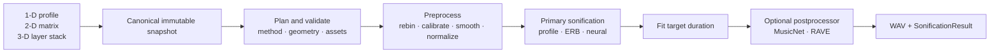

<h1 align="center">MSP · RadioSonify</h1>

<p align="center">
  
</p>

<p align="center">
  <strong>Turn scientific arrays into sound you can inspect, compare, and reproduce</strong><br>
  One-dimensional profiles, two-dimensional matrices, and three-dimensional layer stacks enter one duration-aware pipeline.
</p>

<p align="center">
  <a href="https://github.com/SukiYume/MSP/actions/workflows/ci.yml"></a>
  <a href="https://github.com/SukiYume/MSP/tree/v0.3.0"></a>
  <a href="https://www.python.org/"></a>
  <a href="https://huggingface.co/TorchLight/radiosonify"></a>
  <a href="THIRD_PARTY_NOTICES.md"></a>
</p>

<p align="center">
  <a href="#overview">Overview</a> ·
  <a href="#workflow">Workflow</a> ·
  <a href="#installation">Installation</a> ·
  <a href="#quick-start">Quick start</a> ·
  <a href="#data-and-axes">Data</a> ·
  <a href="#sonification-methods">Methods</a> ·
  <a href="#results-and-reproducibility">Reproducibility</a> ·
  <a href="README_CN.md">简体中文</a>
</p>

---

## Overview

MSP is the repository for **RadioSonify**, a Python package and command-line application that maps numerical data to duration-controlled audio. The project provides one validated path from a scientific array to a mono or stereo WAV together with the resolved parameters needed to reproduce it.

RadioSonify brings the following capabilities into one package:

- **One API for 1-D, 2-D, and 3-D data:** profiles, dynamic spectra, images, spectrograms, polarization products, and other ordered arrays share the same input and timing contracts.
- **Perceptual multidimensional mapping:** time remains playback time, ordered features can become perceptually spaced pitch, and parallel layers can occupy stereo positions.
- **Scientific preprocessing:** area-preserving rebinning, baseline and scale calibration, optional clipping, temporal smoothing, masking, and explicit normalization run in a fixed order.
- **Exact duration control:** physical data duration, repetition, playback speed, pitch preservation, and output sample rate resolve to a deterministic sample count.
- **Audible choices for different goals:** analytic profile mapping, ERB synthesis, Griffin–Lim, HiFi-GAN, spatial ERB, MusicNet, and RAVE are available through the same planning pipeline.
- **Reproducible results:** each call returns an immutable result containing source axes, timing, resolved method settings, preprocessing settings, model-stage metadata, and output details.

## Workflow


```mermaid
flowchart LR
    A["1-D profile<br/>2-D matrix<br/>3-D layer stack"] --> B["Canonical immutable snapshot"]
    B --> C["Plan and validate<br/>method · geometry · assets"]
    C --> D["Preprocess<br/>rebin · calibrate · smooth · normalize"]
    D --> E["Primary sonification<br/>profile · ERB · neural"]
    E --> F["Fit target duration"]
    F --> G["Optional postprocessor<br/>MusicNet · RAVE"]
    G --> H["WAV + SonificationResult"]
```

Every call resolves a complete immutable plan before array transformation. Planning validates the method, settings, array geometry, layer count, output path, optional dependencies, model assets, and neural channel contracts. Execution then applies that plan through preprocessing, primary synthesis, duration fitting, optional audio styling, sample-rate conversion, and WAV conditioning.

Each stage has one responsibility: preprocessing transforms scientific arrays, primary methods define audible mappings, postprocessors reshape audio timbre, and output conditioning creates the final waveform and container.

## Installation

RadioSonify supports Python 3.9 through 3.13.

```bash
git clone https://github.com/SukiYume/MSP.git
cd MSP
python -m pip install .
```

Install the extra required by a neural backend when you plan to use it:

| Capability | Installation |
|---|---|
| HiFi-GAN | `python -m pip install ".[hifigan]"` |
| MusicNet | `python -m pip install ".[musicnet]"` |
| RAVE | `python -m pip install ".[rave]"` |
| Every optional backend | `python -m pip install ".[all]"` |

## Quick start

### Python

```python
from pathlib import Path

import radiosonify as rs

data = rs.load_example("raw_burst")
result = rs.sonify(
    data,
    data_duration=2.4,
    method="erb",
    preprocess_params={"scale_statistic": "mad"},
    output=Path("output/burst.wav"),
)

print(result.sample_rate, result.output_duration)
print(result.preprocess_params)
print(result.method_params)
```

This example treats the first array axis as time, maps the ordered feature axis to perceptual pitch, writes `output/burst.wav`, and returns the fully resolved execution record.

### Command line

```bash
radiosonify download-examples --dest ./data
radiosonify sonify \
  --input data/RawBurst.npy \
  --output output/burst.wav \
  --duration 2.4 \
  --method erb \
  --preprocess scale_statistic=mad
```

CLI settings use repeatable `KEY=VALUE` options. Python literal syntax handles numbers, tuples, dictionaries, booleans, and `None`; plain words become strings. `radiosonify list-settings` prints every shared, method-specific, grouped, and postprocessor setting with its default.

## Data and axes

RadioSonify converts source arrays to a canonical immutable `float64` snapshot while preserving the original shape and declared axes in the result.

| Input | Canonical layout | Default method | Output |
|---|---|---|---|
| 1-D profile | `(time,)` | `amplitude` | mono |
| 2-D matrix | `(time, feature)` | `erb` | mono |
| 3-D layer stack | `(layer, time, feature)` | `spatial_erb` | stereo |

Two-dimensional inputs can represent dynamic spectra, spectrograms, images, or any ordered time-by-feature matrix. Three-dimensional inputs can represent polarization products, image channels, sensor layers, or other parallel matrices. `data_duration` gives the physical span represented by the canonical time axis.

The default time axis is `0` for 1-D and 2-D arrays. The default 3-D layout uses layer axis `0` and time axis `1`. Declare another source ordering explicitly:

```python
import numpy as np
import radiosonify as rs

cube = np.load("layers.npy")
source = rs.SonificationInput(
    cube,
    duration=3.0,
    layer_axis=2,
    time_axis=0,
    name="observation-17",
)
result = rs.sonify(source, method="spatial_erb")
```

The standard input domain contains real finite values. `nan_policy="propagate"` treats NaN values as masks and maps them to silence after normalization. Complex values and infinities raise validation errors.

## Preprocessing

Shared preprocessing gives every primary method the same normalized scientific-array contract:

```text
immutable snapshot
→ layer/time/feature rebinning
→ baseline calibration
→ scale calibration
→ optional percentile clipping
→ timeline repetition
→ temporal smoothing
→ normalization to [0, 1]
```

| Setting | Purpose |
|---|---|
| `layer_rebin` | Target layer count for 3-D data, using ordered area averaging |
| `time_rebin` | Target time-bin count; methods with frame geometry can resolve `"auto"` |
| `feature_rebin` | Target feature-bin count |
| `baseline_operation` | `"subtract"`, `"divide"`, or `None` |
| `baseline_statistic` | `"median"` or `"mean"` |
| `baseline_axis` | Calibration axis or `"auto"` |
| `scale_statistic` | Per-channel `"mad"`, `"std"`, or `None` |
| `clip_percentiles` | Global `(lower, upper)` percentile pair or `None` |
| `time_smoothing` | Gaussian sigma along the canonical time axis or `None` |
| `normalization_scope` | `"global"`, `"per_layer"`, or `"auto"` |
| `nan_policy` | `"raise"` or `"propagate"` |

Downsampling uses equal-width area averages over the full source extent. Upsampling on time and feature axes uses bin-center interpolation. `layer_rebin` performs ordered dimensional reduction. Three-dimensional data defaults to per-layer normalization so each parallel layer remains audible; `layer_gains` carries explicit scientific weighting into spatial synthesis. `repeat` joins copies along the canonical time axis before smoothing and creates one continuous timeline.

The preprocessing stage is also available independently for analysis and inspection:

```python
import numpy as np
import radiosonify as rs

layers = np.load("layers.npy")
prepared_layers = rs.preprocess(
    layers,
    layer_rebin=4,
    time_rebin=2048,
    feature_rebin=512,
    scale_statistic="mad",
)
defaults = rs.preprocessing_defaults()
```

## Sonification methods

### Primary methods

| Method | Inputs | Audible mapping | Main controls | Extra |
|---|---|---|---|---|
| `profile` | 1-D, 2-D | Interpolated profile waveform with an optional analytic instrument response | `sr`, `instrument` | base |
| `amplitude` | 1-D, 2-D | Profile amplitude envelope on a harmonic carrier | `sr`, `freq`, `compression`, `harmonics`, `harmonic_decay` | base |
| `erb` | 2-D | Time to time, ordered feature position to perceptual pitch, brightness and temporal salience to level | Frequency range, band count, timbre, envelope, event, and level settings | base |
| `griffinlim` | 2-D | Mel-like magnitude interpretation with deterministic iterative phase reconstruction | `sr`, `n_iter`, `n_fft`, `frame_length`, `preemphasis`, `max_db`, `ref_db` | base |
| `hifigan` | 2-D | Checkpoint-specific log-mel adapter followed by a HiFi-GAN vocoder | Registered model geometry | `hifigan` |
| `spatial_erb` | 3-D | One ERB synthesis per layer with constant-power stereo panning | ERB controls, `pan_positions`, `layer_gains` | base |

### ERB and spatial ERB

ERB synthesis uses overlapping perceptual bands, phase-continuous carriers, attack/release smoothing, bounded auditory-level compensation, RMS control, and true-peak limiting. `frequency_scale="mel"` follows HTK mel spacing, while `frequency_scale="erb"` selects ERB-rate spacing. `n_bands` controls spectral detail, and `None` derives the count from the selected frequency range.

Available timbres are `sine`, `retro_digital`, `warm_pad`, `soft_marimba`, `glass_bell`, and `instrument_palette`. `instrument_palette` crossfades complementary voices over pitch. `event_voice="water_drop"` adds deterministic transient accents from temporal salience.

```python
matrix = rs.load_example("raw_burst")
result = rs.sonify(
    matrix,
    data_duration=2.4,
    method="erb",
    method_params={
        "min_freq": 90.0,
        "max_freq": 6000.0,
        "n_bands": 48,
        "frequency_scale": "mel",
        "timbre": "instrument_palette",
        "event_voice": "water_drop",
        "voice_params": {"harmonic_limit_hz": 6500.0},
        "event_params": {"max_events_per_second": 3.0, "level_db": -16.0},
    },
)
```

For `spatial_erb`, `pan_positions` ranges from `-1` to `1` and `layer_gains` contains values of `0` or greater. Each sequence provides one value for every planned layer after `layer_rebin`.

### Griffin–Lim and HiFi-GAN

Griffin–Lim derives its valid feature count and automatic time-bin count from `n_fft`, `frame_length`, sample rate, duration, and repetition. HiFi-GAN accepts the shared normalized matrix and applies its published checkpoint's fixed 80-bin encoding within the model adapter. The data-dependent histogram offset appears in `result.method_params`.

### Audio postprocessors

`musicnet` converts mono primary audio into one of six pretrained WaveNet music styles at 16 kHz. Its encoder requires at least 800 samples after resampling, equivalent to 50 ms of primary audio. Planning validates the duration, dependency, and pinned model assets before scientific preprocessing.

`rave` applies a user-supplied exported TorchScript model. Planning loads the model on CPU, reads the standard nn~ `sampling_rate` and `forward_params` metadata, resolves input and output sample rates, and verifies channel compatibility. Inference reloads the same contract on the selected `cpu`, `cuda`, or `mps` device. Mono one-in/one-out models process stereo channels independently, and a mono source can expand into a model's multichannel input.

Use RAVE exports from trusted sources because `torch.jit.load` executes model code. Record the model origin and license with each generated audio product.

```python
profile = rs.load_example("profile")
matrix = rs.load_example("raw_burst")

music_style = rs.sonify(
    profile,
    data_duration=2.0,
    method="amplitude",
    postprocess="musicnet",
    postprocess_params={"decoder_id": 2, "seed": 0},
)

rave_style = rs.sonify(
    matrix,
    data_duration=2.0,
    method="erb",
    postprocess="rave",
    postprocess_params={
        "model_path": "/path/to/trusted-model.ts",
        "device": "auto",
        "seed": 0,
    },
)
```

## Timing and output

Every primary method uses one duration equation:

```text
target_duration = data_duration × repeat ÷ speed
```

`speed=2` produces half the source duration, and `speed=0.5` produces twice the source duration. The registered repeat default is `5` for `amplitude` and `1` for every other primary method. An explicit `repeat` overrides the registered value.

`preserve_pitch=True` selects phase-vocoder time stretching. The standard polyphase path changes playback speed and pitch together. `output_sr` selects the final sample rate while preserving duration and physical pitch. The final sample count is `round(output_sr × target_duration)` when `output_sr` is supplied.

Output conditioning removes DC, applies short edge fades, constrains peak level, creates parent directories, and writes WAV data after path validation.

## Results and reproducibility

`sonify` returns an immutable `SonificationResult` containing the final waveform and the complete resolved execution record.

| Fields | Contents |
|---|---|
| `audio`, `sample_rate`, `output_duration`, `output_path` | Final waveform and container |
| `data_type`, `data_duration`, `input_shape`, `source_name` | Source identity and physical extent |
| `source_time_axis`, `source_layer_axis` | Axes in the caller's original layout |
| `method`, `preprocess_params`, `method_params` | Primary mapping and fully resolved settings |
| `speed`, `repeat`, `preserve_pitch`, `target_duration` | Timing contract |
| `method_sample_rate`, `method_native_samples`, `method_native_duration`, `method_time_scale` | Primary synthesis timing |
| `postprocess`, `postprocess_params`, `postprocess_native_samples`, `postprocess_native_duration`, `postprocess_time_scale` | Optional audio-style stage |

Parameter mappings are recursively copied and frozen. Numeric arrays use immutable byte-backed snapshots. A reproducible scientific or public release can record:

1. the RadioSonify version and source checksum;
2. the source shape, axes, name, and physical duration;
3. the resolved preprocessing, method, timing, and postprocessor mappings;
4. the neural model revision, origin, and license when a model is used;
5. the final sample rate, channel count, duration, and WAV checksum.

## Assets and discovery

Inspect the installed capabilities from the CLI:

```bash
radiosonify list-methods
radiosonify list-settings
radiosonify --help
radiosonify download-examples --dest ./data
```

The same discovery functions are available in Python:

```python
rs.available_methods()
rs.available_methods("matrix")
rs.available_postprocessors()
rs.default_method("matrix")

profile = rs.load_example("profile")
burst = rs.load_example("burst")
raw_burst = rs.load_example("raw_burst")
parkes_burst = rs.load_example("parkes_burst")
```

Example arrays, HiFi-GAN weights, and MusicNet checkpoints come from the pinned [`TorchLight/radiosonify`](https://huggingface.co/TorchLight/radiosonify) revision stored in `radiosonify.hub.REVISION`. Assets download on first use into `~/.cache/radiosonify`; `RADIOSONIFY_CACHE_DIR` selects another cache directory. Analytic `profile` instrument responses are generated locally and cached alongside downloaded assets.

| Resource | Provenance and use |
|---|---|
| Example arrays and `Burst-wirfi.wav` | Small API demonstrations retained from the original MSP project under MIT; scientific releases should preserve and cite their own input provenance. |
| HiFi-GAN config and checkpoint | Universal V1 architecture and base checkpoint from [`jik876/hifi-gan`](https://github.com/jik876/hifi-gan), followed by 500k MSP fine-tuning steps on symphonic recordings; the historical corpus has limited training-data-level provenance. |
| MusicNet checkpoints | Official pretrained archive from Facebook Research's [A Universal Music Translation Network](https://github.com/facebookresearch/music-translation), covered by CC BY-NC 4.0 and its non-commercial-use condition. |
| RAVE model | A trusted TorchScript export supplied by the user, with provenance and license recorded for that model. |

The HiFi-GAN adapter resizes the preprocessed feature axis to 80 bins, restores the resized matrix to `[0, 1]`, estimates its histogram mode `m`, and applies `12 * (x + 0.6 - m) - 10.5`, clipped to `[-11, 1.6]`. The result records `m` in `method_params`. [Third-party notices and asset provenance](THIRD_PARTY_NOTICES.md) provide the complete component licenses, verification history, model safety guidance, and source links.

## Project layout

| Path | Responsibility |
|---|---|
| `src/radiosonify/api.py`, `planning.py`, `pipeline.py` | Public facade, immutable plan resolution, and plan execution |
| `src/radiosonify/inputs.py`, `preprocessing.py` | Canonical snapshots, source axes, scientific calibration, resizing, masking, and normalization |
| `src/radiosonify/profile.py`, `amplitude.py`, `erb.py`, `spatial.py`, `griffinlim.py`, `hifigan.py` | Primary sonification methods |
| `src/radiosonify/_perceptual.py`, `_voices.py`, `_events.py` | Shared perceptual synthesis, sustained timbres, palettes, and transient events |
| `src/radiosonify/musicnet.py`, `rave.py` | Optional audio postprocessors and their runtime contracts |
| `src/radiosonify/timing.py`, `audio_io.py`, `hub.py` | Duration fitting, output conditioning, WAV writing, and pinned assets |
| `src/radiosonify/validation.py`, `array_ops.py`, `registry.py`, `runtime.py` | Shared validation, generic array transforms, capability registration, and optional runtime support |
| `src/radiosonify/models/` | Checkpoint-compatible vendored inference definitions and adjacent licenses |
| `tests/`, `examples/`, `assets/` | Regression tests, runnable examples, and project artwork |

## Development

Install the complete development environment and run the same core gates used by CI:

```bash
python -m pip install -e ".[all,dev]"
python -m ruff check src tests examples
python -m ruff format --check src tests examples
python -m mypy
python -m vulture
python -m pytest -q --cov=radiosonify --cov-report=term-missing --cov-fail-under=90
python -m build
python -m twine check dist/*
```

Changes to neural adapters or vendored inference definitions should also run `python -m pytest -q tests/test_hifigan.py tests/test_musicnet.py tests/test_rave.py tests/test_vendored_models.py`.

Keep scientific resizing, baseline correction, clipping, smoothing, and normalization in `preprocessing.py`; resolve public execution policy in `planning.py`; execute validated plans in `pipeline.py`. Add regression tests for behavior changes, update both READMEs and [CHANGELOG.md](CHANGELOG.md) for public changes, and keep generated audio, downloaded checkpoints, and observation data outside the repository.

Checkpoint-compatible definitions under `src/radiosonify/models/` retain upstream parameter names, tensor shapes, license headers, and the policies in their `VENDORED.md` files. Asset changes should update [THIRD_PARTY_NOTICES.md](THIRD_PARTY_NOTICES.md), the adjacent licenses, and the Hugging Face model card together. Release validation builds both distributions, runs Twine checks, installs the wheel in a clean environment, exercises `radiosonify list-methods`, and verifies that both license texts are packaged.

## Citation and license

For scientific or public-facing work, record the RadioSonify version, source checksum, physical duration, source axes, resolved parameters, model revision, and output checksum. Cite the software repository and any model or dataset source used in the mapping.

MSP-authored code uses the [MIT License](LICENSE). The vendored MusicNet inference subset and checkpoints use CC BY-NC 4.0 with a non-commercial-use condition. Distribution metadata uses `MIT AND CC-BY-NC-4.0`, and [THIRD_PARTY_NOTICES.md](THIRD_PARTY_NOTICES.md) gives component-level terms.

---

<p align="center"><sub>MSP · Making multidimensional scientific structure audible</sub></p>
