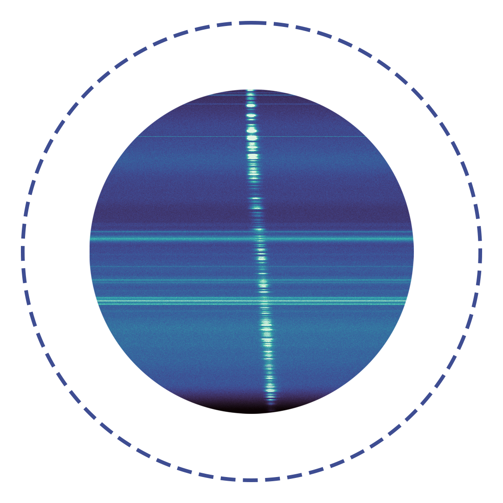

# Methods for Sonifying Pulse (MSP)

_✨ Sonifying a radio pulse ✨_

  

  <a href="./README_CN.md" target="_blank">切换到中文</a>

## Description

Radio telescopes can digitize and record electromagnetic signals, and the raw data format produced is entirely consistent with the common WAV audio files. However, the frequencies received by radio telescopes are typically outside the range of human hearing, so the raw data needs to be mixed and downconverted to a frequency range that is audible.

However, this raw data takes up a lot of storage space, and telescopes generally do not record such data extensively. Typically, a Fourier transform is performed on the data, converting it into the time-frequency domain, and the phase information is discarded, as shown in the image above. This greatly reduces storage requirements. But because the phase information is discarded, we cannot recover the original data from this format.

How can we sonify such data that has undergone a Fourier transform? Here are some examples of methods for sonifying it.

## List of Methods

Method 1

 

The first method uses `astronify`, a Python library for sonifying light curves. The example is in `0-astronify.py`.

We first average our data along the frequency axis, leaving only the pulse profile. Then, `astronify` maps the profile intensity to pitch and writes it to an audio file. However, I'm not very fond of this approach—the resulting sound is a bit odd and requires very specific parameters. It works better for light curves in the optical band (which are relatively smooth).

Method 2

 

The second method directly writes the pulse profile into a WAV file. The example is in `1-profile2wave.py`.

This method produces audio that sounds quite similar for different data, so you can convolve the pulse profile with audio from different musical instruments to achieve different timbres.

Method 3

 

The third method maps the pulse profile to loudness. The example is in `2-amp2loud.py`.

Method 4

 

The fourth method uses a vocoder. Examples are in `3-griffinlim.py` and `4-hifi-gan.py`.

As mentioned earlier, the phase information in the data has been discarded, so it cannot be restored to its original form. However, we can assume some phase information and perform an `ISTFT` (inverse short-time Fourier transform). This means treating the time-frequency data as a Mel-spectrogram and using it to reconstruct audio. The traditional vocoder that works well is `griffin_lim`, which assumes an initial phase and iteratively adjusts it so that the reconstructed audio’s Mel-spectrogram closely matches the provided one.

With the development of deep learning, TTS (text-to-speech) has become increasingly sophisticated. In addition to end-to-end TTS systems, there are two-stage TTS systems, where the first stage generates a Mel-spectrogram from text, and the second stage converts the Mel-spectrogram into sound. The second stage often uses similar vocoders. Neural vocoders have evolved from `WaveNet`, `WaveRNN`, `UnivNet`, to `HiFi-GAN` and `BigVGAN`. Here, we use the pre-trained `Universal V1` model from `HiFi-GAN`. As demonstrated in the [BigVGAN](https://bigvgan-demo.github.io/) audio examples, `HiFi-GAN` performs quite well for instrument synthesis and is usable. You can find more details about [HiFi-GAN](https://github.com/jik876/hifi-gan) in the official repo.

Building on the `Universal V1` model of `HiFi-GAN`, we fine-tuned it using 500 symphony tracks, training for an additional 500k steps. The new model is located in `HiFiGAN/model`. Testing the model on our data yielded satisfactory results.

In the example below, the left image shows the original data in the time-frequency domain, and the right image shows the result after converting it to audio and applying a short-time Fourier transform. Since human hearing perceives sound logarithmically, the profile has undergone logarithmic mapping.

Below is a sample of the converted audio.

https://raw.githubusercontent.com/SukiYume/MSP/refs/heads/main/Data/Burst-wirfi.wav

 - 

 Method 5 

 

The example is in `5-musicnet.py`. This may not count as a new method but rather applies style transfer to the output music. We use the model from [A Universal Music Translation Network](https://arxiv.org/abs/1805.07848), which can be found [here](https://github.com/facebookresearch/music-translation).

They provide five pre-trained models, corresponding to the following styles:
| No.   | 0         | 1        | 2           | 3           | 4             | 5           |
| ----- | ----------| -------- | ----------- | ----------- | ------------- | ----------- |
| Instrument | Accompaniment Violin | Solo Cello | Solo Piano | Solo Piano   | String Quartet | Organ Quintet |
| Composer  | Beethoven  | Bach      | Bach       | Beethoven   | Beethoven    | Cambini     |

 - 
