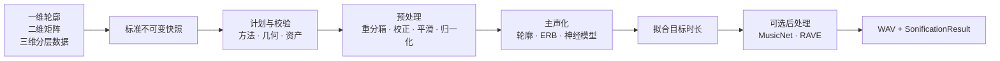

<h1 align="center">MSP · RadioSonify</h1>

<p align="center">
  
</p>

<p align="center">
  <strong>让科学数组成为可听、可控、可复现的声音</strong><br>
  一维轮廓、二维矩阵和三维分层数据共享同一套时长感知声化流程。
</p>

<p align="center">
  <a href="https://github.com/SukiYume/MSP/actions/workflows/ci.yml"></a>
  <a href="https://github.com/SukiYume/MSP/tree/v0.3.0"></a>
  <a href="https://www.python.org/"></a>
  <a href="https://huggingface.co/TorchLight/radiosonify"></a>
  <a href="THIRD_PARTY_NOTICES.md"></a>
</p>

<p align="center">
  <a href="#项目概览">项目概览</a> ·
  <a href="#工作流程">工作流程</a> ·
  <a href="#安装">安装</a> ·
  <a href="#快速开始">快速开始</a> ·
  <a href="#数据与坐标轴">数据</a> ·
  <a href="#声化方法">方法</a> ·
  <a href="#结果与复现">复现</a> ·
  <a href="README.md">English</a>
</p>

---

## 项目概览

MSP 是 **RadioSonify** 的项目仓库。RadioSonify 提供 Python 包和命令行程序，将数值数据映射为时长可控的音频，并通过一条经过校验的流程生成单声道或立体声 WAV 与完整解析参数。

RadioSonify 将以下能力整合在同一个项目中：

- **一套 API 支持一维、二维和三维数据：** 脉冲轮廓、动态谱、图像、声谱图、偏振分量及其他有序数组共享输入与时长契约。
- **感知友好的多维映射：** 时间保持为播放时间，有序特征可映射到感知均匀的音高，并列数据层可映射到立体声位置。
- **科学数据预处理：** 面积守恒重分箱、基线与尺度校正、可选裁剪、时间平滑、掩码和显式归一化按照固定顺序执行。
- **精确的时长控制：** 物理数据时长、重复次数、播放速度、音高保持和输出采样率共同解析为确定的样本数。
- **面向不同目标的声音方案：** 解析轮廓映射、ERB 合成、Griffin–Lim、HiFi-GAN、空间 ERB、MusicNet 和 RAVE 共用同一计划流程。
- **可复现的结果对象：** 每次调用都会返回来源轴、时序、完整方法设置、预处理设置、模型阶段元数据和输出信息。

## 工作流程



每次调用都会在数组变换前解析出完整的不可变执行计划。计划阶段统一校验方法、设置、数组几何、层数、输出路径、可选依赖、模型资产和神经模型通道契约。执行阶段依次完成预处理、主合成、时长拟合、可选音色转换、采样率转换和 WAV 整形。

各阶段拥有清晰职责：预处理负责科学数组变换，主方法负责可听映射，后处理器负责音频音色转换，输出整形负责最终波形与容器。

## 安装

RadioSonify 支持 Python 3.9 至 3.13。

```bash
git clone https://github.com/SukiYume/MSP.git
cd MSP
python -m pip install .
```

使用神经后端时安装对应扩展依赖：

| 能力 | 安装命令 |
|---|---|
| HiFi-GAN | `python -m pip install ".[hifigan]"` |
| MusicNet | `python -m pip install ".[musicnet]"` |
| RAVE | `python -m pip install ".[rave]"` |
| 全部可选后端 | `python -m pip install ".[all]"` |

## 快速开始

### Python

```python
from pathlib import Path

import radiosonify as rs

data = rs.load_example("raw_burst")
result = rs.sonify(
    data,
    data_duration=2.4,
    method="erb",
    preprocess_params={"scale_statistic": "mad"},
    output=Path("output/burst.wav"),
)

print(result.sample_rate, result.output_duration)
print(result.preprocess_params)
print(result.method_params)
```

这个示例把数组第一轴视为时间，将有序特征轴映射到感知音高，写入 `output/burst.wav`，并返回完整的执行记录。

### 命令行

```bash
radiosonify download-examples --dest ./data
radiosonify sonify \
  --input data/RawBurst.npy \
  --output output/burst.wav \
  --duration 2.4 \
  --method erb \
  --preprocess scale_statistic=mad
```

CLI 设置使用可重复的 `KEY=VALUE` 选项。数值、元组、字典、布尔值和 `None` 采用 Python 字面量语法，普通单词作为字符串。`radiosonify list-settings` 会显示全部共享设置、方法设置、分组设置、后处理器设置及其默认值。

## 数据与坐标轴

RadioSonify 将来源数组转换为标准布局的不可变 `float64` 快照，并在结果中保留原始形状和已声明坐标轴。

| 输入 | 标准布局 | 默认方法 | 输出 |
|---|---|---|---|
| 一维轮廓 | `(time,)` | `amplitude` | 单声道 |
| 二维矩阵 | `(time, feature)` | `erb` | 单声道 |
| 三维分层数据 | `(layer, time, feature)` | `spatial_erb` | 立体声 |

二维输入可表示动态谱、声谱图、图像或其他有序的时间乘特征矩阵。三维输入可表示偏振分量、图像通道、传感器分层或其他并列矩阵。`data_duration` 给出标准时间轴对应的物理时间跨度。

一维和二维数组默认使用时间轴 `0`。三维标准布局默认使用层轴 `0` 和时间轴 `1`。其他来源布局可通过参数显式声明：

```python
import numpy as np
import radiosonify as rs

cube = np.load("layers.npy")
source = rs.SonificationInput(
    cube,
    duration=3.0,
    layer_axis=2,
    time_axis=0,
    name="observation-17",
)
result = rs.sonify(source, method="spatial_erb")
```

标准输入域包含有限实数。`nan_policy="propagate"` 将 NaN 作为掩码，并在归一化后映射为静音。复数和无穷值会触发校验错误。

## 预处理

共享预处理为全部主方法提供一致的归一化科学数组契约：

```text
不可变快照
→ 层/时间/特征轴重分箱
→ 基线校正
→ 尺度校正
→ 可选分位裁剪
→ 时间线重复
→ 时间平滑
→ 归一化到 [0, 1]
```

| 设置 | 用途 |
|---|---|
| `layer_rebin` | 三维数据的目标层数，使用有序面积平均 |
| `time_rebin` | 目标时间格数；带帧几何的方法可解析 `"auto"` |
| `feature_rebin` | 目标特征格数 |
| `baseline_operation` | `"subtract"`、`"divide"` 或 `None` |
| `baseline_statistic` | `"median"` 或 `"mean"` |
| `baseline_axis` | 校正轴或 `"auto"` |
| `scale_statistic` | 逐通道 `"mad"`、`"std"` 或 `None` |
| `clip_percentiles` | 全数组 `(lower, upper)` 分位数组合或 `None` |
| `time_smoothing` | 标准时间轴上的高斯 sigma 或 `None` |
| `normalization_scope` | `"global"`、`"per_layer"` 或 `"auto"` |
| `nan_policy` | `"raise"` 或 `"propagate"` |

降采样使用覆盖完整来源范围的等宽面积平均。时间轴与特征轴升采样使用格中心插值。`layer_rebin` 执行有序降维。三维数据默认逐层归一化，让每个并列层保持可听；`layer_gains` 可将显式科学权重带入空间合成。`repeat` 在时间平滑前沿标准时间轴拼接副本，形成一条连续时间线。

预处理也可以独立调用，便于分析和检查：

```python
import numpy as np
import radiosonify as rs

layers = np.load("layers.npy")
prepared_layers = rs.preprocess(
    layers,
    layer_rebin=4,
    time_rebin=2048,
    feature_rebin=512,
    scale_statistic="mad",
)
defaults = rs.preprocessing_defaults()
```

## 声化方法

### 主方法

| 方法 | 输入 | 可听映射 | 主要控制项 | 扩展依赖 |
|---|---|---|---|---|
| `profile` | 一维、二维 | 插值轮廓波形与可选解析乐器响应 | `sr`、`instrument` | 基础安装 |
| `amplitude` | 一维、二维 | 谐波载波上的轮廓振幅包络 | `sr`、`freq`、`compression`、`harmonics`、`harmonic_decay` | 基础安装 |
| `erb` | 二维 | 时间映射到时间，有序特征位置映射到感知音高，亮度与时间显著性映射到声级 | 频率范围、频带数、音色、包络、事件和声级设置 | 基础安装 |
| `griffinlim` | 二维 | 类 mel 幅度解释与确定性迭代相位重建 | `sr`、`n_iter`、`n_fft`、`frame_length`、`preemphasis`、`max_db`、`ref_db` | 基础安装 |
| `hifigan` | 二维 | checkpoint 专用 log-mel 适配器与 HiFi-GAN 声码器 | 注册模型几何 | `hifigan` |
| `spatial_erb` | 三维 | 每层独立 ERB 合成与恒功率立体声声像 | ERB 控制项、`pan_positions`、`layer_gains` | 基础安装 |

### ERB 与 spatial ERB

ERB 合成使用重叠感知频带、相位连续载波、起音/释音平滑、受限听觉声级补偿、RMS 控制和真峰值限制。`frequency_scale="mel"` 使用 HTK mel 间距，`frequency_scale="erb"` 使用 ERB-rate 间距。`n_bands` 控制频谱细节，`None` 会根据所选频率范围计算频带数。

可用音色包括 `sine`、`retro_digital`、`warm_pad`、`soft_marimba`、`glass_bell` 和 `instrument_palette`。`instrument_palette` 随音高连续交叉混合互补音色。`event_voice="water_drop"` 根据时间显著性加入确定性瞬态点缀。

```python
matrix = rs.load_example("raw_burst")
result = rs.sonify(
    matrix,
    data_duration=2.4,
    method="erb",
    method_params={
        "min_freq": 90.0,
        "max_freq": 6000.0,
        "n_bands": 48,
        "frequency_scale": "mel",
        "timbre": "instrument_palette",
        "event_voice": "water_drop",
        "voice_params": {"harmonic_limit_hz": 6500.0},
        "event_params": {"max_events_per_second": 3.0, "level_db": -16.0},
    },
)
```

`spatial_erb` 的 `pan_positions` 取值范围为 `-1` 至 `1`，`layer_gains` 取值为 `0` 或正数。两个序列都需要为 `layer_rebin` 之后的每个计划层提供一个值。

### Griffin–Lim 与 HiFi-GAN

Griffin–Lim 根据 `n_fft`、`frame_length`、采样率、时长和重复次数推导有效特征格数与自动时间格数。HiFi-GAN 接收共享归一化矩阵，并在模型适配器内执行已发布 checkpoint 的固定 80 格编码。随数据变化的直方图偏移记录在 `result.method_params` 中。

### 音频后处理器

`musicnet` 将单声道主音频转换为六种预训练 WaveNet 音乐风格之一，原生采样率为 16 kHz。编码器需要重采样后至少 800 个样本，对应 50 ms 的主音频。计划阶段会在科学预处理前校验时长、依赖和固定模型资产。

`rave` 使用用户提供的 TorchScript 导出模型。计划阶段先在 CPU 加载模型，读取标准 nn~ `sampling_rate` 与 `forward_params` 元数据，解析输入与输出采样率并校验通道兼容性。推理阶段在所选 `cpu`、`cuda` 或 `mps` 设备重新核对同一契约。单进单出的单声道模型可逐声道处理立体声，单声道来源也可扩展到模型的多通道输入。

请使用可信来源的 RAVE 导出文件，因为 `torch.jit.load` 会执行模型代码。每个生成音频都适合记录模型来源与许可证。

```python
profile = rs.load_example("profile")
matrix = rs.load_example("raw_burst")

music_style = rs.sonify(
    profile,
    data_duration=2.0,
    method="amplitude",
    postprocess="musicnet",
    postprocess_params={"decoder_id": 2, "seed": 0},
)

rave_style = rs.sonify(
    matrix,
    data_duration=2.0,
    method="erb",
    postprocess="rave",
    postprocess_params={
        "model_path": "/path/to/trusted-model.ts",
        "device": "auto",
        "seed": 0,
    },
)
```

## 时长与输出

全部主方法采用同一个时长公式：

```text
target_duration = data_duration × repeat ÷ speed
```

`speed=2` 产生来源时长的一半，`speed=0.5` 产生来源时长的两倍。`amplitude` 的注册重复默认值为 `5`，其余主方法为 `1`。显式 `repeat` 会覆盖注册值。

`preserve_pitch=True` 选择相位声码器时间伸缩。标准多相路径会让播放速度与音高一起变化。`output_sr` 选择最终采样率，并保持时长和物理音高。提供 `output_sr` 时，最终样本数为 `round(output_sr × target_duration)`。

输出整形会移除直流分量、添加短边缘淡入淡出、约束峰值、创建父目录，并在路径校验后写入 WAV。

## 结果与复现

`sonify` 返回不可变的 `SonificationResult`，其中包含最终波形和完整解析后的执行记录。

| 字段 | 内容 |
|---|---|
| `audio`、`sample_rate`、`output_duration`、`output_path` | 最终波形与容器 |
| `data_type`、`data_duration`、`input_shape`、`source_name` | 来源标识与物理范围 |
| `source_time_axis`、`source_layer_axis` | 调用者原始布局中的轴 |
| `method`、`preprocess_params`、`method_params` | 主映射与完整解析设置 |
| `speed`、`repeat`、`preserve_pitch`、`target_duration` | 时长契约 |
| `method_sample_rate`、`method_native_samples`、`method_native_duration`、`method_time_scale` | 主合成时序 |
| `postprocess`、`postprocess_params`、`postprocess_native_samples`、`postprocess_native_duration`、`postprocess_time_scale` | 可选音频风格阶段 |

参数映射会递归复制并冻结，数值数组使用不可变字节缓冲区快照。可复现的科学或公开发布适合记录：

1. RadioSonify 版本和来源校验和；
2. 来源形状、坐标轴、名称和物理时长；
3. 完整解析后的预处理、方法、时序和后处理器映射；
4. 神经模型的 revision、来源和许可证；
5. 最终采样率、声道数、时长和 WAV 校验和。

## 资产与功能查询

通过命令行查看已安装能力：

```bash
radiosonify list-methods
radiosonify list-settings
radiosonify --help
radiosonify download-examples --dest ./data
```

Python 提供对应的查询函数：

```python
rs.available_methods()
rs.available_methods("matrix")
rs.available_postprocessors()
rs.default_method("matrix")

profile = rs.load_example("profile")
burst = rs.load_example("burst")
raw_burst = rs.load_example("raw_burst")
parkes_burst = rs.load_example("parkes_burst")
```

示例数组、HiFi-GAN 权重和 MusicNet checkpoint 来自固定 revision 的 [`TorchLight/radiosonify`](https://huggingface.co/TorchLight/radiosonify)，revision 存储在 `radiosonify.hub.REVISION`。资产在首次使用时下载到 `~/.cache/radiosonify`，`RADIOSONIFY_CACHE_DIR` 可选择其他缓存目录。`profile` 的解析乐器响应在本地生成，并与下载资产共用缓存目录。

| 资源 | 来源与用途 |
|---|---|
| 示例数组与 `Burst-wirfi.wav` | 原始 MSP 项目保留的小型 API 示例，采用 MIT 许可；科学发布应保存并引用实际输入数据的来源。 |
| HiFi-GAN 配置与 checkpoint | 基于 [`jik876/hifi-gan`](https://github.com/jik876/hifi-gan) 的 Universal V1 架构和基础 checkpoint，随后由 MSP 使用交响乐录音训练 500k 步；历史语料的训练数据级来源记录有限。 |
| MusicNet checkpoint | 来自 Facebook Research [A Universal Music Translation Network](https://github.com/facebookresearch/music-translation) 的官方预训练包，采用带非商业用途条件的 CC BY-NC 4.0。 |
| RAVE 模型 | 用户提供的可信 TorchScript 文件，其来源和许可证随具体模型记录。 |

HiFi-GAN 适配器先把完成预处理的特征轴调整为 80 个频带，将调整后的矩阵恢复到 `[0, 1]`，估计直方图众数 `m`，再计算 `12 * (x + 0.6 - m) - 10.5` 并裁剪到 `[-11, 1.6]`。结果通过 `method_params` 记录 `m`。[第三方声明与资产来源](THIRD_PARTY_NOTICES.md)提供完整的组件许可证、核验历史、模型安全说明和来源链接。

## 项目结构

| 路径 | 职责 |
|---|---|
| `src/radiosonify/api.py`、`planning.py`、`pipeline.py` | 公共入口、不可变计划解析与计划执行 |
| `src/radiosonify/inputs.py`、`preprocessing.py` | 标准快照、来源轴、科学校正、尺寸调整、掩码和归一化 |
| `src/radiosonify/profile.py`、`amplitude.py`、`erb.py`、`spatial.py`、`griffinlim.py`、`hifigan.py` | 主声化方法 |
| `src/radiosonify/_perceptual.py`、`_voices.py`、`_events.py` | 共享感知合成、持续音色、音色组合与瞬态事件 |
| `src/radiosonify/musicnet.py`、`rave.py` | 可选音频后处理器及其运行契约 |
| `src/radiosonify/timing.py`、`audio_io.py`、`hub.py` | 时长拟合、输出整形、WAV 写入与固定资产 |
| `src/radiosonify/validation.py`、`array_ops.py`、`registry.py`、`runtime.py` | 共享校验、通用数组变换、能力注册与可选运行环境支持 |
| `src/radiosonify/models/` | 与 checkpoint 兼容的 vendored 推理定义及相邻许可证 |
| `tests/`、`examples/`、`assets/` | 回归测试、可运行示例和项目图像 |

## 开发

安装完整开发环境并运行 CI 使用的核心门禁：

```bash
python -m pip install -e ".[all,dev]"
python -m ruff check src tests examples
python -m ruff format --check src tests examples
python -m mypy
python -m vulture
python -m pytest -q --cov=radiosonify --cov-report=term-missing --cov-fail-under=90
python -m build
python -m twine check dist/*
```

修改神经模型适配器或 vendored 推理定义时，还应运行 `python -m pytest -q tests/test_hifigan.py tests/test_musicnet.py tests/test_rave.py tests/test_vendored_models.py`。

科学数据的尺寸调整、基线校正、裁剪、平滑和归一化集中在 `preprocessing.py`，公共执行策略在 `planning.py` 解析，`pipeline.py` 执行完成校验的计划。行为变更需要补充回归测试，公共变化需要同步更新两份 README 和 [CHANGELOG.md](CHANGELOG.md)，生成音频、下载的 checkpoint 与观测数据保存在仓库外。

`src/radiosonify/models/` 中与 checkpoint 兼容的定义保留上游参数名、张量形状、许可证头和各自 `VENDORED.md` 中的维护规则。资产变化应同步更新 [THIRD_PARTY_NOTICES.md](THIRD_PARTY_NOTICES.md)、相邻许可证与 Hugging Face 模型卡。发行验证会构建两种发行包、运行 Twine 检查、在全新环境安装 wheel、执行 `radiosonify list-methods`，并核对两份许可证文本均已打包。

## 引用与许可证

用于科学研究或公开展示时，请记录 RadioSonify 版本、来源校验和、物理时长、来源轴、完整解析参数、模型 revision 和输出校验和，并引用声化过程中使用的软件仓库、模型和数据来源。

MSP 自有代码使用 [MIT License](LICENSE)。内置 MusicNet 推理子集与 checkpoint 使用带非商业用途条件的 CC BY-NC 4.0。分发元数据采用 `MIT AND CC-BY-NC-4.0`，[THIRD_PARTY_NOTICES.md](THIRD_PARTY_NOTICES.md) 提供各组件条款。

---

<p align="center"><sub>MSP · 让多维科学结构成为可听信息</sub></p>
